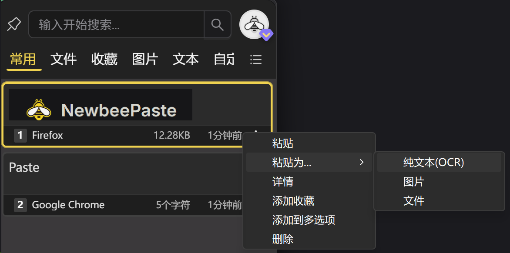
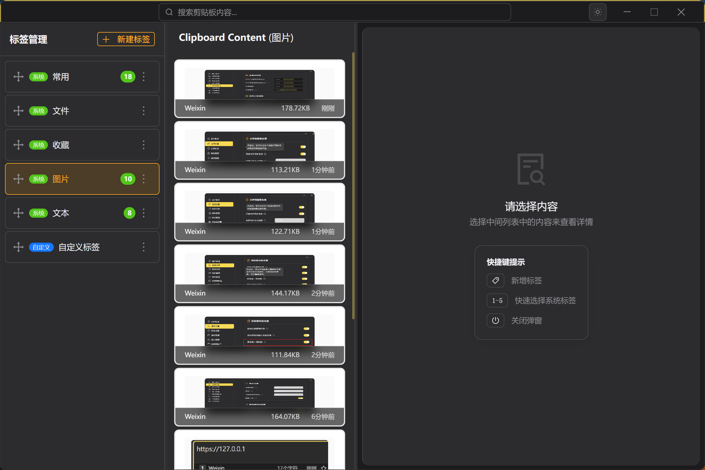

# 剪贴板管理器核心功能

Paste Newbee 是首款支持跨操作系统、跨设备实时同步文本、图片、文件的剪贴板管理软件。作为业界领先的网络剪贴板工具，致力于提升内容复制粘贴的效率与体验，适用于日常办公、开发协作与跨设备数据传输等多种场景。

## 一、剪贴板管理器多种内容类型支持

Paste 剪贴板管理器支持丰富的内容类型，智能分类展示，避免内容混乱，是真正专业的网络剪贴板工具。

- **纯文本**：如笔记、地址、标签等常规文本内容的云剪贴板存储
- **富文本**：支持保留字体、颜色、链接等格式的在线剪贴板文本
- **图片**：支持 JPG/PNG/WebP 等图片格式的预览与存储，配合OCR识别
- **文件与文件夹路径**：可复制文件信息并快捷访问的网络粘贴板功能

## 二、剪贴板管理软件的OCR与格式增强

Paste 剪贴板管理软件内置OCR功能，会自动识别并高亮以下内容，提高可读性与操作效率：

- 图片文字OCR智能识别和提取
- 超链接识别并可点击跳转  
- 支持代码语法高亮（20+ 语言）
- 颜色代码（如 `#FF5733`）预览显示
- JSON、HTML、Markdown 格式结构化处理

## 三、高颜值剪贴板管理界面

Paste 网络剪贴板提供业界领先的高颜值界面与自然的交互体验：

- 支持明亮/暗黑主题一键切换的云剪切板界面
- 内容拖拽排序、悬停预览等现代化交互
- 长列表支持快速定位与折叠的在线剪贴板设计

## 四、跨系统同步与文件传输

Paste 剪贴板管理器支持以下独有的跨系统云剪贴板同步能力，提升跨端效率：

### 跨系统实时同步

- 支持跨操作系统的云剪切板实时同步
- 支持 Windows / Mac 原生集成，移动端开发中
- 同一账号登录后自动同步内容，真正的网络剪贴板体验

### 跨设备文件传输云剪贴板

- 支持直接复制粘贴文件，在设备间快速传送的网络粘贴板
- 支持断点续传与传输历史查看的在线剪贴板功能  

## 五、多标签剪贴板管理与智能操作

Paste 剪贴板管理器提供完善的多标签管理和高效操作方式：

- 支持 `ALT + V` 或 `Option + V` 快速唤起网络剪贴板主界面
- 智能搜索历史内容，按类型/标签/关键字查找的云剪切板功能
- 支持标签自定义、自动分类整理的在线剪贴板管理

## 六、剪贴板管理软件个性化设置

Paste 网络剪贴板提供灵活的个性化设置选项：

- 开机自启、剪贴板监控、最大记录条数等云剪切板配置
- 多语言界面（简体中文、繁体中文、英文）
- 通知提示、界面动画控制等在线剪贴板偏好设置

::: tip 💡 小技巧
所有功能均可在设置中启用/禁用，按需配置可获得最佳体验。
:::

## 七、剪贴板管理与隐私保护

Paste 云剪贴板重视用户数据隐私与使用安全，提供完善的剪贴板安全管理：

- 所有数据本地加密存储的网络剪贴板安全机制
- 跨设备传输采用 TLS 加密通道的云剪切板保护
- 可选择不记录密码/验证码等敏感信息的在线剪贴板过滤
- 支持一键清除历史记录的网络粘贴板管理
- 全流程数据加密，保障用户隐私安全

::: warning ⚠️ 权限提醒
首次使用部分功能（如辅助功能、磁盘访问）时，系统会请求权限。请根据提示授予，以确保功能正常运行。
:::

## 附：支持内容类型一览表

| 类型      | 支持 | 备注                   |
| --------- | ---- | ---------------------- |
| 纯文本    | ✅    | 支持快捷粘贴与搜索     |
| 富文本    | ✅    | 保留格式、字体、颜色等 |
| 图片      | ✅    | 可预览和复制           |
| 文件路径  | ✅    | 快捷访问与传输         |
| 超链接    | ✅    | 可点击并自动跳转       |
| 代码块    | ✅    | 自动识别并高亮语法     |
| 表格      | ✅    | 粘贴后保留基本格式     |
| JSON/HTML | ✅    | 自动缩进与格式化预览   |
